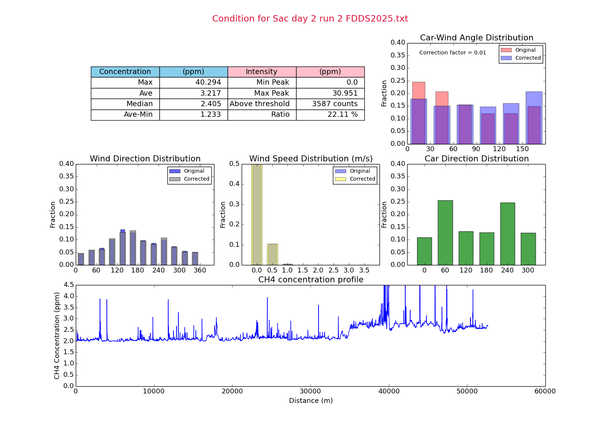
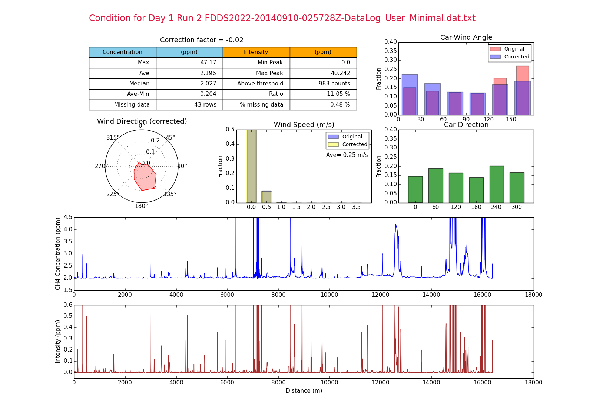
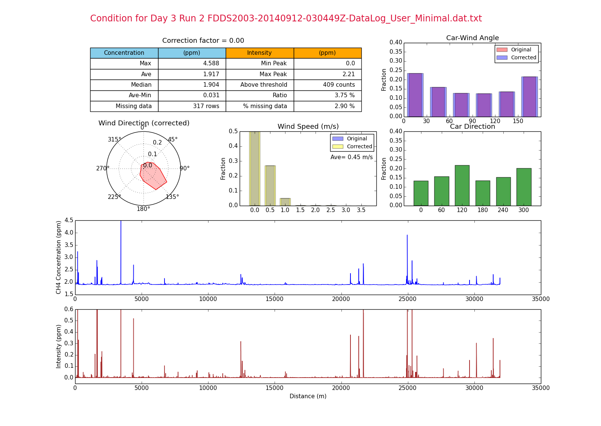

# Mobile survey dashboard

Below are screenshots of dashboards summarizing the results of daily vehicle-based natural gas leak survey that I developed using Python *pandas* and *matplotlib* back in 2014 when I was still working for a gas utility company. 

Upon starting the python code, there is a small pop-up asking the user for the data file (csv format) to process. Then the program will run and produce the dashboard. 

In the first version of the dashboard, we monitored the wind direction, car direction, and car-wind angle to ensure that there was no bias in the wind measurement (anemometer) of the survey vehicle as it was traveling at 20-30 mph. By checking the spread of distribution of car direction and car-wind angle, we were able to compute the magnitude of correction factor that should be applied in order to correct for the bias in the anemometer measurements. The methane concentration profile lets us know which areas of the survey had elevated methane levels which are indicative of natural gas emissions or background noises.

The later version of the dashboard had a wind rose to show the distribution of wind direction in the survey and bar charts to show the distribution of car direction and car wind angle. We also added an intensity chart (red line) at the bottom to indicate the level of methane concentration above the background level (rolling average of the last 5 minutes). Ultimately, the goal is to ensure that the data collected is not biased and can be used to inform ground crew of leak indications locations.

